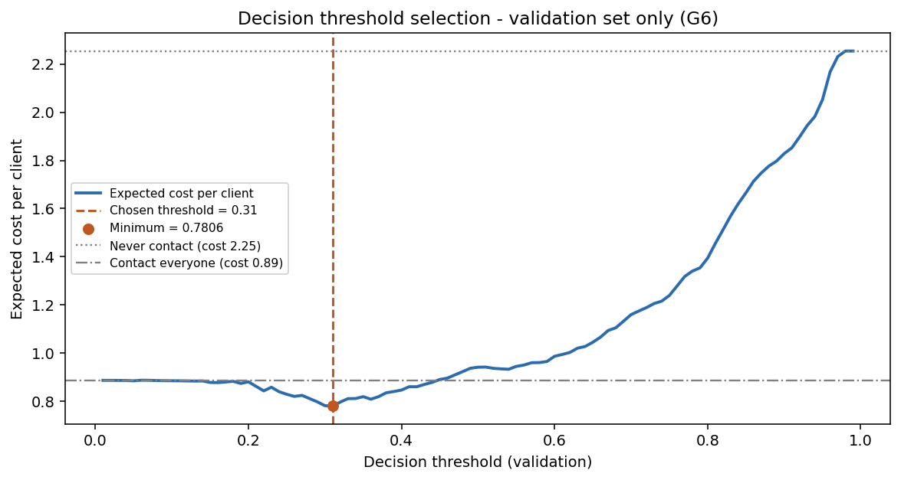
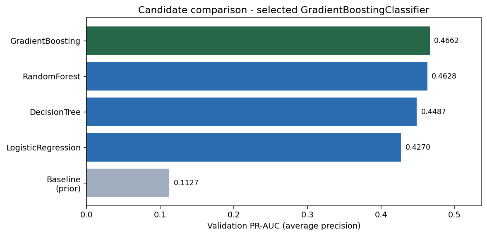
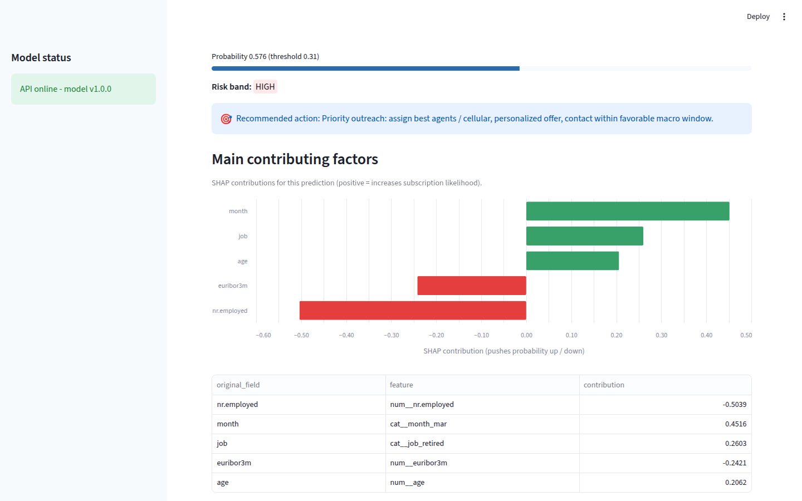
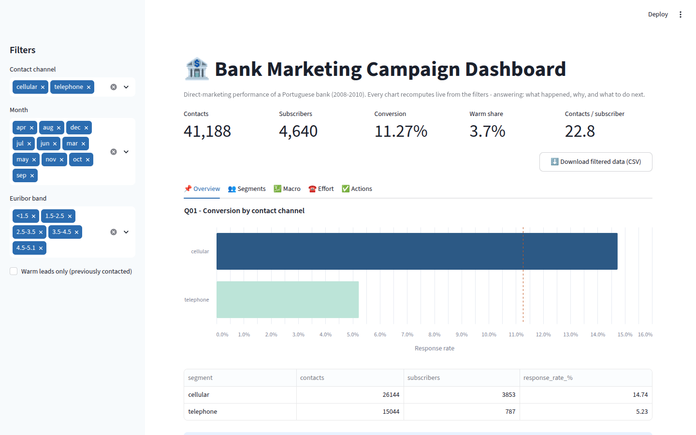
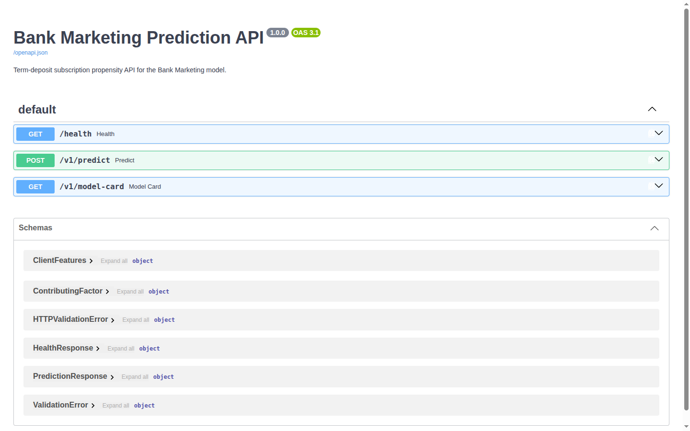

# Bank Marketing Prediction

[](LICENSE)
[](https://www.python.org/)
[](https://scikit-learn.org/)
[](https://fastapi.tiangolo.com/)
[](https://streamlit.io/)
[](docker-compose.yml)
[](#quickstart)

End-to-end machine learning project on the **Bank Marketing** dataset (UCI ML
Repository, `bank-additional-full`; Moro, Cortez & Silva, 2014): from a governed data
audit to a deployed prediction stack — a **pre-call propensity model** for term-deposit
subscriptions, a FastAPI scoring service with per-prediction SHAP explanations, two
Streamlit apps, and one-command Docker deployment.

## TL;DR

- **What:** 41,188 phone-marketing contacts (Portuguese bank, 2008-2010) scored
  **before** the call for term-deposit subscription propensity, with per-prediction
  SHAP explanations and a business recommendation attached to every score.
- **Result:** GradientBoostingClassifier with ROC-AUC **0.819** / PR-AUC **0.475** /
  recall **0.861** at a cost-optimized threshold of **0.31** (20:1 FN:FP cost matrix,
  threshold tuned on validation only, test evaluated exactly once).
- **Stack:** FastAPI (validated inputs, `/v1/predict` with contributing factors),
  two Streamlit apps (predictor + business dashboard), one-command Docker deployment.
- **Run it:** `make setup && make test`, or `make docker-build && make docker-up`
  (API :8000, predictor :8501, dashboard :8502).
- **Differentiators:** strict pre-call feature policy (no post-call leakage), a human
  approval gate that separates business analysis from target selection, and a test
  set touched exactly once.

## Results

| Metric (test) | Value | Notes |
| --- | --- | --- |
| ROC-AUC | **0.819** | GradientBoostingClassifier, seed 42 |
| PR-AUC (avg precision) | **0.475** | vs. 0.113 prior baseline (11.3% positive class) |
| Recall @ threshold | **0.861** | missing a subscriber costs 20x a wasted call |
| Expected cost / client | **0.734** | vs. 0.888 (contact everyone) and 2.253 (contact nobody) |

The decision threshold (**0.31**) is chosen on the validation split by minimizing the
expected cost under a 20:1 false-negative:false-positive cost matrix. The test set is
evaluated exactly once.

| Threshold-cost curve (validation) | Baseline vs. candidates |
| --- | --- |
|  |  |

## Screenshots

| Predictive app | Business dashboard |
| --- | --- |
|  |  |

The **predictive app** scores one contact before the call: probability, decision,
risk band, recommended action, and per-prediction SHAP contributions (green pushes the
probability up, red pushes it down). The **dashboard** recomputes the five business
questions live from interactive filters and closes with what/why/what-to-do actions.

## Dataset

- **File:** `data/raw/bank_data.csv` (semicolon-separated, 41,188 rows x 21 columns)
- **Content:** direct-marketing campaigns of a Portuguese banking institution,
  combining client attributes, campaign attributes, and social/economic indicators.
- **Source:** [UCI ML Repository - Bank Marketing](https://archive.ics.uci.edu/dataset/222/bank+marketing),
  exact variant `bank-additional-full.csv` (41,188 rows x 21 columns, May 2008 -
  November 2010); Moro, Cortez & Silva (2014).
- **Kaggle:** [Bank Marketing Dataset](https://www.kaggle.com/datasets/janiobachmann/bank-marketing-dataset)
  — quick-access copy of the classic variant. Note: it carries the older
  17-column data (`bank.csv`), which lacks the macroeconomic indicators used by
  this model; this project trains on the 21-column UCI variant.
- **Feature policy (strict pre-call model):** `duration` (post-call leakage),
  `poutcome`, and `campaign` are excluded per the user-approved feature policy —
  the model only uses information available *before* the call is made.

## Quickstart

```bash
make setup                 # create .venv and install pinned requirements
make test                  # run the pytest suite (artifacts are included)
```

### Full stack with Docker (recommended)

```bash
make docker-build
make docker-up             # api:8000, predict-app:8501, dashboard:8502
```

Then open the interactive API docs at `http://localhost:8000/docs`.



### Run each layer locally

```bash
make run-api               # FastAPI prediction API on :8000
make run-predict-app       # Streamlit predictive app on :8501 (needs the API)
make run-dashboard         # Streamlit business dashboard on :8502
```

### Rebuild the model from scratch

```bash
make data-audit            # Phase 1: audit + data dictionary
make business-analysis     # Phase 2: 5 business questions
make target-proposal       # Phase 3: target proposal (stops for approval)
make train                 # Phase 4: baseline -> candidates -> final evaluation
```

## Methodology

The project is organized in sequential, gated phases. Two design decisions are worth
highlighting:

- **Human approval gate (G1-G6).** Business analysis (phases 1-2) and target
  selection (phase 3) are independent: no target is proposed or ranked during
  analysis. The proposed target (`y`, binary term-deposit subscription) is only
  activatable after an explicit stakeholder approval recorded in
  `docs/json/target_approval.json` with the approved feature policy and cost matrix.
  Phase 4 refuses to run without it.
- **Test discipline.** Preprocessing, model selection, and threshold tuning happen on
  train/validation splits only; the test set is touched exactly once by
  `scripts/p4_evaluate_final_model.py` (enforced by design and by tests).

## Project structure

```
├── data/raw            raw dataset (versioned)
├── configs             project / model / business configuration (JSON)
├── scripts             phase scripts (p1_, p2_, p3_, p4_)
├── src                 package code: config loader, data prep, model, API (src/api)
├── apps                Streamlit predict app + business dashboard
├── models              persisted model / preprocessor / explainer / metadata
├── tests               test_data.py, test_model.py, test_api.py
└── docs                Markdown reports, JSON artifacts, charts, screenshots
```

## Key documents (`/docs`)

| Document | Purpose |
| --- | --- |
| [data_dictionary.md](docs/data_dictionary.md) | Per-column schema, PII/temporal/leakage flags |
| [data_quality_report.md](docs/data_quality_report.md) | Missing values, duplicates, imbalance, PII inventory |
| [problem_statement.md](docs/problem_statement.md) | Neutral discovery of business problems |
| [business_analysis_report.md](docs/business_analysis_report.md) | Quantified insights and recommended actions |
| [target_proposal.md](docs/target_proposal.md) | Proposed target with evidence and approval gate |
| [model_report.md](docs/model_report.md) | Modeling decisions, evaluation, features, explanations |
| [model_card.md](docs/model_card.md) | Model purpose, performance, and limitations |
| [api_documentation.md](docs/api_documentation.md) | Prediction API reference |
| [deployment_documentation.md](docs/deployment_documentation.md) | Docker deployment guide |

## License

Released under the [MIT License](LICENSE).
