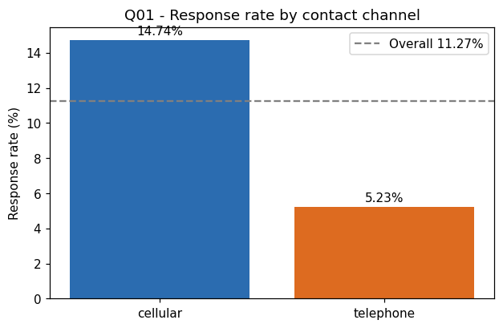
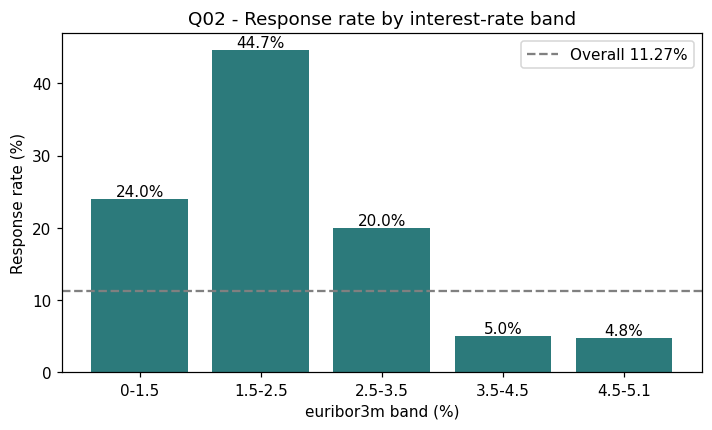
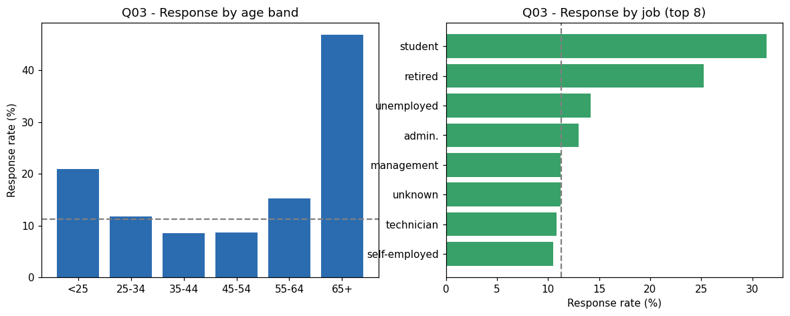
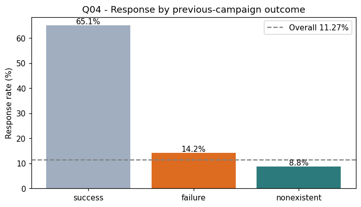
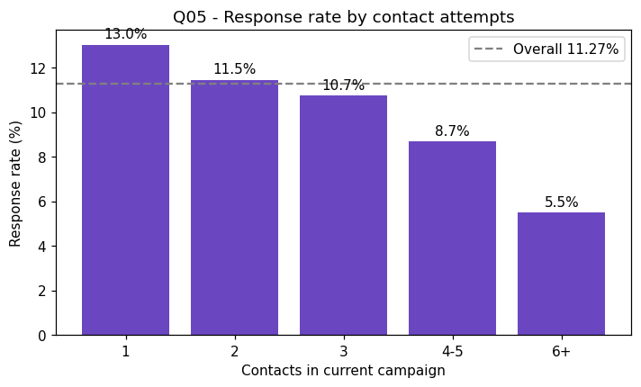

# Business Analysis Report - Phase 2

Quantified business value in the Bank Marketing dataset, via five data-backed
questions. Every insight cites its code, output, metric, interpretation, and a
recommended action.

> **Governance (G1).** Descriptive analysis only. **No predictive model is trained and no
> modeling target is selected, ranked, or proposed here.** Insights inform - but do not
> constitute - the Phase 3 target proposal.

**Headline:** the campaign's base response rate is **11.27%**, but the spread across
controllable and observable conditions is enormous (from ~5% to ~65%). Almost the entire
value of this dataset lies in **re-allocating a fixed outbound-calling budget toward
higher-probability contacts**.

---

## Executive summary

| Driver | Worst | Best | Spread | Lever type |
| --- | --- | --- | --- | --- |
| Macro / interest-rate window (Q02) | 4.8% | 44.7% | ~9x | Campaign timing |
| Prior-contact history (Q04) | 9.3% (cold) | 63.8% (warm) | ~7x | Lead targeting |
| Customer segment (Q03) | 7.8% | 46.9% | ~6x | Calling-list curation |
| Contact channel (Q01) | 5.2% (tel.) | 14.7% (cell.) | ~2.8x | Capacity mix |
| Contact attempts (Q05) | 5.5% (6+) | 13.0% (1st) | ~2.4x | Effort cap |

## Q01 - Channel conversion

Cellular contacts convert at **14.74%** vs **5.23%** for telephone - a **2.82x** lift on the
same client population (evidence: `docs/json/p2_q01_metrics.json`,
`scripts/p2_q01_channel_conversion.py`). **Action:** favor cellular for any client reachable on
both; treat telephone as overflow.

## Q02 - Economic conditions (strongest driver)

Response moves inversely with the rate/labor environment: euribor 0-1.5 band = **24.0%**,
1.5-2.5 band = **44.7%**, while the crowded 4.5-5.1 band = **4.8%**. Point-biserial
correlations with response: `nr.employed` **-0.36**, `euribor3m` **-0.31**,
`emp.var.rate` **-0.30** (evidence: `docs/json/p2_q02_metrics.json`). **Action:** size and time
waves to favorable windows and keep the macro indicators as first-class model inputs.

## Q03 - Customer segments

Segments well above the 11.27% base: students **31.4%**, retirees **25.2%** (job); 65+
**46.9%** and under-25 **21.0%** (age); singles **14.0%** (evidence:
`docs/json/p2_q03_metrics.json`). **Action:** curate calling lists toward these while modeling
them jointly with the macro context (they are correlated with timing).

## Q04 - Prior-contact history

Previously-contacted clients convert at **63.8%** vs **9.3%** for never-contacted;
`poutcome='success'` = **65.1%**. But **96.3%** of contacts are cold, so the reachable-warm pool
is tiny and a model is still essential for the cold majority (evidence:
`docs/json/p2_q04_metrics.json`). **Action:** work warm leads first; keep history features but
**review `poutcome` for decision-time availability** (leakage flag from Phase 1) before
production use.

## Q05 - Campaign effort

Marginal conversion decays with attempts (13.0% on the first contact, 5.5% at 6+) while **83.3%
of all contacts are spent on repeat dialing**, averaging **22.8 contacts per subscriber** (evidence:
`docs/json/p2_q05_metrics.json`). **Action:** cap attempts based on predicted propensity and
redirect freed capacity to high-probability cold leads.

---

## Consolidated recommendation

The five drivers form one coherent operating model:

1. **When:** run intensive waves in low-rate / weak-employment windows (Q02).
2. **Who:** guarantee warm/previously-contacted leads (Q04) and high-propensity segments (Q03)
   are contacted first.
3. **How:** prefer cellular (Q01) and cap repeat attempts on low-propensity clients (Q05).
4. **What's missing:** a **propensity score** that combines these signals per client to rank
   the huge cold pool. That scoring need is the natural analytic follow-on and will be
   formalized, with explicit user approval, as the modeling target in **Phase 3**.

Machine-readable form: [`json/insights.json`](json/insights.json). Operational banding logic
(the propensity tiers and outreach actions above) is codified - as a provisional template
pending target approval - in [`../configs/business_rules.json`](../configs/business_rules.json).
