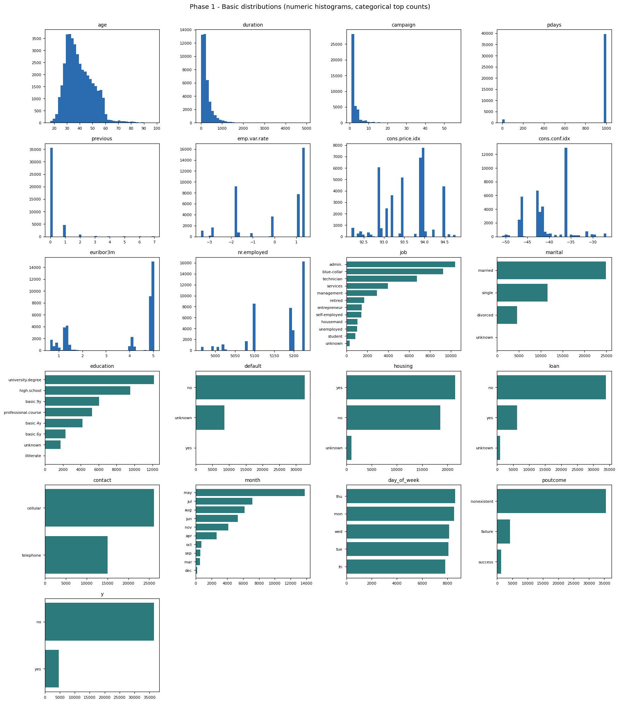

# Data Quality Report

Dataset: `data/raw/bank_data.csv` (semicolon-separated). Source: UCI ML Repository - Bank Marketing.

## 1. Structure

| Metric | Value |
| --- | --- |
| Rows | 41,188 |
| Columns | 21 |
| Numeric columns | 10 |
| Categorical columns | 11 |
| Approx. memory | 9.53 MB |

## 2. Missing values

The file has **no explicit NaN cells**, but several categorical columns encode missingness as the string `"unknown"`, which behaves as missing for modeling. Effective missingness combines both.

| Column | NaN | "unknown" category | Effective missing | Effective % |
| --- | --- | --- | --- | --- |
| job | 0 | 330 | 330 | 0.80% |
| marital | 0 | 80 | 80 | 0.19% |
| education | 0 | 1,731 | 1,731 | 4.20% |
| default | 0 | 8,597 | 8,597 | 20.87% |
| housing | 0 | 990 | 990 | 2.40% |
| loan | 0 | 990 | 990 | 2.40% |

Columns with zero effective missingness: 15 of 21.

## 3. Duplicates

| Check | Count |
| --- | --- |
| Fully duplicated rows | 12 |
| Rows duplicated on age+job+marital+education+contact+month+day_of_week | 17,825 |

Recommendation: drop exact duplicate rows before modeling (keep first) to avoid leaking identical records across splits. Note the dataset has no unique client id, so same-attribute rows may also be genuine distinct contacts.

## 4. Constant / near-constant columns

| Column | Dominant value share | Flag |
| --- | --- | --- |
| pdays | 96.32% | near-constant |

Special note: `default` = `yes` occurs only **3** times (0.007% of rows); the column is almost entirely `no`/`unknown` and carries negligible signal.

## 5. Data type issues & sentinels

- **`pdays = 999` sentinel:** 39,673 rows (96.3%) use 999 to mean 'never contacted before', not a real 999-day gap. Must be recoded (e.g., a boolean `previously_contacted` + numeric days) or it will distort any distance/mean logic.
- **`age`:** minimum observed value is 17 and maximum 98. A value of 17 in a banking customer base is implausible and should be treated as an outlier/error; range clipping or exclusion is recommended.
- **`duration`:** right-skewed (max 4,918s). Flagged as a leakage column (see Section 7).

## 6. Numeric outliers (IQR rule)

| Column | Min | Max | IQR-outlier count | IQR-outlier % |
| --- | --- | --- | --- | --- |
| age | 17 | 98 | 469 | 1.14% |
| duration | 0 | 4918 | 2,963 | 7.19% |
| campaign | 1 | 56 | 2,406 | 5.84% |
| pdays | 0 | 999 | 1,515 | 3.68% |
| previous | 0 | 7 | 5,625 | 13.66% |
| cons.conf.idx | -50 | -26 | 447 | 1.09% |

Outliers are largely genuine heavy-tail business quantities (long calls, many contacts). Recommend log/scaling transforms and capping at percentile bounds rather than deletion.

## 7. Response-style column balance (descriptive only)

For completeness required by PLAN Section 6.1, the discrete yes/no-style columns are profiled below. **This is a factual distribution report, not a target proposal or ranking (G1).** Target selection happens in Phase 3.

| Column | Level counts | Minority share |
| --- | --- | --- |
| y | no=36,548, yes=4,640 | 11.27% |

Balance note: yes/no-style columns show minority classes well under 20%, so any predictive task on them would require explicit class-imbalance handling (class weights / resampling, PR-AUC).

## 8. PII / sensitive columns inventory

| Column | Category | Recommended handling | Justification |
| --- | --- | --- | --- |
| default | financial / credit standing (sensitive) | Keep with justification | Credit-default flag is sensitive financial data; near-constant here and low signal, so excluding it is safer for fairness/privacy. |
| housing | financial / existing liability (sensitive) | Keep with justification | Existing-liability flag is sensitive; usable as a feature with a documented fairness review. |
| loan | financial / existing liability (sensitive) | Keep with justification | Existing-liability flag is sensitive; usable as a feature with a documented fairness review. |

There are **no direct identifiers** (no names, emails, phone numbers, account or national-id fields). `age` is a quasi-identifier but is aggregated demographic data. No masking is strictly required, but sensitive financial flags should be handled with a documented fairness/privacy review.

## 9. Temporal coverage

- Time-ordered fields present: **month, day_of_week**.
- Months observed: may=13,769, jul=7,174, aug=6,178, jun=5,318, nov=4,101, apr=2,632, oct=718, sep=570, mar=546, dec=182.
- There is **no explicit date/timestamp column**; the bank-additional variant only carries month and day-of-week, so a strictly row-level chronological ordering is not directly available. The macroeconomic indicators (`emp.var.rate`, `euribor3m`, `nr.employed`) imply the collection period (roughly the second half of 2008-2010, with a heavy May concentration). For Phase 4, a stratified split is likely more practical than a time-based split, but temporal seasonality (`month`) should be modeled.

## 10. Potential data leakage

| Column | Reason |
| --- | --- |
| duration | Only known AFTER the call ends and is a near-deterministic proxy for the outcome (a refusal typically ends the call early). Must be excluded from any pre-call/predictive model. |
| poutcome | 'success' reflects a prior subscription and correlates strongly with the current outcome; usable only if the business truly has it at decision time. Flagged as potential leakage to review. |

## 11. Initial hypotheses (neutral, non-ranked)

1. Economic climate at campaign time (`euribor3m`, `emp.var.rate`, `nr.employed`, `cons.conf.idx`) is likely a strong driver of response, independent of the client.
2. Seasonality is material: a large share of contacts occur in `may`, and month is correlated with the macro indicators.
3. Prior relationship matters: `poutcome`, `previous`, and recency (`pdays`) encode whether the client was reachable/interested before.
4. Contact channel (`contact`) and contact intensity (`campaign`) shape reachability and possible fatigue.
5. `duration` would trivially predict the outcome but is not available before the call, so it must be excluded from a deployable model (see leakage note).

These are exploratory hypotheses only. No target variable has been selected, ranked, or proposed in this phase (G1).

