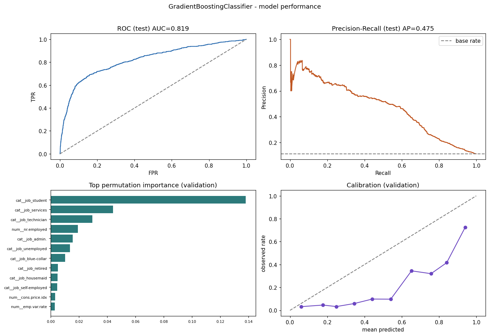

# Model Report - Phase 4

## Decision: classification vs regression

The user approved target **y** is a binary outcome (term-deposit subscription), so this is **binary classification**. The business wants a decision (contact / priority tier), which maps naturally to a probability and a threshold, matching the Phase 2 band structure and the 20:1 cost matrix (see `configs/business_rules.json`).

## Governance

- Target approval: `docs/json/target_approval.json` (status **approved**, 2026-09-13T19:22:25+00:00).
- Seed 42 fixed across split, CV, and every model.
- Feature policy (user-approved): EXCLUDE duration, poutcome, campaign.
- Test set evaluated exactly once at the validation-chosen threshold (G6).

## Split strategy

Stratified 70/15/15 on the target, seed 42. Justification: no row-level chronological field exists (only cyclic month/day-of-week), so a stratified split preserves class balance; see model_report.md.

Sizes: train 28,823, validation 6,176, test 6,177.

## Preprocessing

Median impute + StandardScaler (numeric); most-frequent impute + one-hot, handle_unknown=ignore (categorical). Fit on TRAIN only. pdays 999 sentinel -> previously_contacted flag + pdays_days; age clipped [18,95].

## Candidate selection (validation)

| Model | CV AP (mean) | Val PR-AUC | Val ROC-AUC | Thr | Val exp. cost |
| --- | --- | --- | --- | --- | --- |
| GradientBoostingClassifier | 0.4524 | 0.4662 | 0.7970 | 0.310 | 0.7806 |
| RandomForestClassifier | 0.4562 | 0.4628 | 0.7968 | 0.320 | 0.7898 |
| DecisionTreeClassifier | 0.4355 | 0.4487 | 0.7881 | 0.260 | 0.7934 |
| LogisticRegression | 0.4423 | 0.4270 | 0.7913 | 0.310 | 0.7874 |

Selected **GradientBoostingClassifier** on validation PR-AUC.

## Decision threshold

Threshold **0.31** chosen on validation by minimizing expected cost with false_negative_cost=20, false_positive_cost=1 (recall-leaning: missing a subscriber is weighted far above a wasted contact).

## Test results (single evaluation)

| Metric | Value |
| --- | --- |
| Accuracy | 0.5640 |
| Precision | 0.1875 |
| Recall | 0.8606 |
| F1 | 0.3079 |
| ROC-AUC | 0.8194 |
| PR-AUC (avg precision) | 0.4753 |
| Brier score | 0.1515 |
| Expected cost / client | 0.7343 |

Confusion matrix at threshold 0.31: TP=599, FN=97, FP=2596, TN=2885 (positive = subscribed).

Baseline reference: prior-probability model val PR-AUC 0.1127, accuracy 0.8873. The selected model far exceeds it.

## Feature importance (global, permutation on validation)

| Rank | Feature | Mean AP drop |
| --- | --- | --- |
| 1 | `cat__job_student` | 0.13816 |
| 2 | `cat__job_services` | 0.04403 |
| 3 | `cat__job_technician` | 0.02947 |
| 4 | `num__nr.employed` | 0.01922 |
| 5 | `cat__job_admin.` | 0.01547 |
| 6 | `cat__job_unemployed` | 0.01369 |
| 7 | `cat__job_blue-collar` | 0.01018 |
| 8 | `cat__job_retired` | 0.00514 |
| 9 | `cat__job_housemaid` | 0.00495 |
| 10 | `cat__job_self-employed` | 0.00454 |
| 11 | `num__cons.price.idx` | 0.00315 |
| 12 | `num__emp.var.rate` | 0.00281 |

## Calibration (validation)

| Bin | Count | Mean predicted | Observed rate |
| --- | --- | --- | --- |
| [0.0,0.1) | 31 | 0.060 | 0.032 |
| [0.1,0.2) | 783 | 0.176 | 0.046 |
| [0.2,0.3) | 1998 | 0.249 | 0.033 |
| [0.3,0.4) | 1595 | 0.346 | 0.060 |
| [0.4,0.5) | 548 | 0.442 | 0.099 |
| [0.5,0.6) | 266 | 0.541 | 0.098 |
| [0.6,0.7) | 171 | 0.652 | 0.345 |
| [0.7,0.8) | 253 | 0.757 | 0.320 |
| [0.8,0.9) | 346 | 0.842 | 0.416 |
| [0.9,1.0) | 185 | 0.941 | 0.724 |

## Notes and limitations

- Term-deposit response model for the historical (2008-2010) campaign context.
- duration/poutcome/campaign excluded per user-approved feature policy.
- Class imbalance handled via balanced weights; PR-AUC primary metric.
- Macro-indicator drift may limit transfer to future economic regimes.

